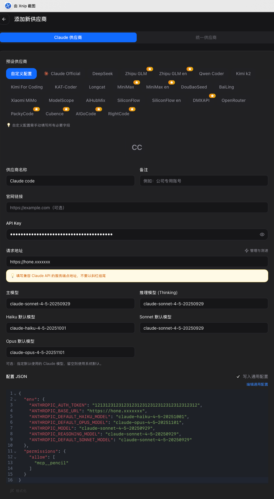
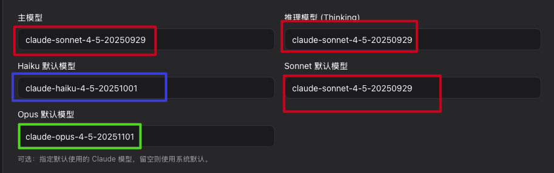

# Claude Code 使用指南

> 📌 **注意**：国内用户需要使用代理访问

## 目录
- [安装配置](#安装配置)
- [对话模式介绍](#对话模式介绍)
- [VSCode 常用功能](#vscode-常用功能)

---

## 安装配置

### macOS 安装步骤

#### 前置要求
确保已经安装 [Homebrew](https://brew.sh/)

#### 1. 安装 Claude Code CLI
```bash
brew install --cask claude-code
```

#### 2. 安装 cc-switch（推荐）
```bash
# 添加 tap 源
brew tap farion1231/ccswitch

# 安装 cc-switch
brew install --cask cc-switch

# 更新命令
brew upgrade --cask cc-switch
```

#### 3. 安装 VSCode
下载地址：https://code.visualstudio.com/docs/setup/mac

#### 4. 安装 VSCode 扩展
1. 打开 VSCode
2. 点击左侧扩展图标（或按 `Cmd+Shift+X`）
3. 搜索 "Claude Code for VS Code"
4. 点击安装
5. 在 vscode 中打开设置搜索claudeCode.disableLoginPrompt勾选禁用


#### 5. 配置 cc-switch
    主模型模型:
    claude-sonnet-4-5-20250929
    推理模型 (Thinking):
    claude-sonnet-4-5-20250929
    Sonnet 默认模型:
    claude-sonnet-4-5-20250929
    Haiku 默认模型:
    claude-haiku-4-5-20251001
    Opus 默认模型:
    claude-opus-4-5-20251101



**可选**：安装中文语言包
- 搜索并安装 "Chinese (Simplified) (简体中文)" 扩展

---

## 对话模式介绍

Claude Code 提供三种对话模式，适应不同的使用场景：

### 🛡️ Ask before edits（询问后编辑）
- **特点**：每次修改前都会征求你的同意
- **适用场景**：重要项目、需要精确控制的修改
- **优势**：安全可控，避免意外修改
- **推荐指数**：⭐⭐⭐⭐⭐

### ⚡ Edit automatically（自动编辑）
- **特点**：直接修改代码，不需要确认
- **适用场景**：快速迭代、实验性项目
- **优势**：效率高，节省时间
- **注意**：可能产生意外修改，建议配合版本控制使用
- **推荐指数**：⭐⭐⭐⭐

### 📋 Plan demo（仅规划）
- **特点**：只提供实现方案，不修改代码
- **适用场景**：需要先了解实现思路、学习新技术
- **优势**：适合学习和评估方案
- **推荐指数**：⭐⭐⭐

### 快速选择指南
```
只想看思路 → Plan demo
想控制改动 → Ask before edits
想快点改完 → Edit automatically
```


---

## VSCode 常用功能

### 1. 文件引用（@ 符号）

在对话中使用 `@` 符号可以快速引用文件或文件夹：

```
@filename.ts          # 引用特定文件
@src/components/      # 引用整个文件夹
@README.md 帮我优化这个文档  # 引用文件并提问
```

**使用技巧**：
- 输入 `@` 后会自动显示文件列表
- 支持模糊搜索
- 可以同时引用多个文件

### 2. 代码选择上下文

Claude Code 会自动识别你在编辑器中选中的代码：

1. 在编辑器中选中代码
2. 打开 Claude Code 对话框
3. 直接提问，Claude 会基于选中的代码回答

**示例**：
```
选中一个函数 → 问"这个函数有什么问题？"
选中一段代码 → 问"帮我重构这段代码"
```

### 3. 斜杠命令（Slash Commands）

快速执行常见任务的命令：

| 命令 | 功能 | 使用场景 |
|------|------|----------|
| `/commit` | 创建 Git 提交 | 自动生成提交信息并提交代码 |
| `/review-pr` | 审查 Pull Request | 分析 PR 的代码变更 |
| `/help` | 获取帮助 | 查看 Claude Code 使用说明 |
| `/clear` | 清空对话 | 开始新的对话主题 |

**使用方法**：
```
/commit              # 自动分析变更并创建提交
/review-pr 123       # 审查 PR #123
```

### 4. 键盘快捷键

提高效率的快捷键：

| 快捷键 | 功能 |
|--------|------|
| `Cmd+Shift+P` | 打开命令面板 |
| `Cmd+K` | 打开 Claude Code 对话 |
| `Cmd+Enter` | 发送消息 |
| `Esc` | 取消当前操作 |

**自定义快捷键**：
- 使用 `/keybindings-help` 命令查看如何自定义快捷键
- 配置文件位置：`~/.claude/keybindings.json`

### 5. 工具能力

Claude Code 可以执行多种操作：

#### 📖 文件操作
- **Read**：读取文件内容
- **Write**：创建新文件
- **Edit**：修改现有文件
- **Glob**：查找文件（支持通配符）
- **Grep**：搜索文件内容

#### 💻 命令执行
- **Bash**：执行终端命令
- 支持 git、npm、docker 等常用命令
- 可以运行测试、构建项目等

#### 🔍 代码分析
- 自动理解项目结构
- 识别代码模式和最佳实践
- 提供重构建议

### 6. MCP 服务器

Claude Code 支持 MCP（Model Context Protocol）服务器扩展功能：

**常见 MCP 服务器**：
- **文件系统**：访问本地文件
- **Git**：版本控制操作
- **数据库**：查询数据库
- **API**：调用外部 API

**配置位置**：`~/.claude/settings.json`

### 7. 实用技巧

#### 💡 提问技巧
```
❌ 不好的提问："优化代码"
✅ 好的提问："@app.ts 这个文件的性能瓶颈在哪里？如何优化？"

❌ 不好的提问："有 bug"
✅ 好的提问："运行 npm test 后出现错误，帮我修复"
```

#### 🎯 任务分解
对于复杂任务，Claude Code 会：
1. 自动创建任务列表（Todo List）
2. 逐步完成每个子任务
3. 实时更新进度

#### 🔄 版本控制集成
```bash
# Claude Code 可以帮你：
- 查看 git status
- 创建提交（/commit）
- 审查 PR（/review-pr）
- 解决合并冲突
```

#### 📊 项目分析
```
"分析这个项目的架构"
"找出所有的 TODO 注释"
"检查代码中的安全问题"
```

### 8. 最佳实践

#### ✅ 推荐做法
- 使用 `@` 引用相关文件，提供更多上下文
- 选中代码后再提问，让 Claude 理解具体问题
- 使用 "Ask before edits" 模式处理重要代码
- 定期使用 `/commit` 提交代码变更
- 善用斜杠命令提高效率

#### ❌ 避免做法
- 不要在没有版本控制的项目中使用 "Edit automatically"
- 不要一次性提出过多要求
- 不要忽略 Claude 的安全提示
- 不要在生产环境直接使用未测试的代码

### 9. 常见问题

**Q: Claude Code 会修改我的代码吗？**
A: 取决于你选择的模式。"Ask before edits" 会先征求同意，"Edit automatically" 会直接修改。

**Q: 如何撤销 Claude 的修改？**
A: 使用 Git 版本控制，可以随时回退：`git checkout -- <file>`

**Q: Claude Code 支持哪些编程语言？**
A: 支持所有主流编程语言，包括 JavaScript、Python、Java、Go、Rust 等。

**Q: 如何提高 Claude 的回答质量？**
A: 提供更多上下文（使用 `@` 引用文件）、明确描述问题、选中相关代码。

**Q: Claude Code 是否需要联网？**
A: 是的，需要连接到 Anthropic 的 API 服务器（国内需要代理）。

---

## 更多资源

- 📚 [官方文档](https://docs.anthropic.com/claude/docs)
- 🐛 [问题反馈](https://github.com/anthropics/claude-code/issues)
- 💬 [社区讨论](https://github.com/anthropics/claude-code/discussions)

---

## 许可证

本文档采用 MIT 许可证。

---

**祝你使用愉快！🎉**