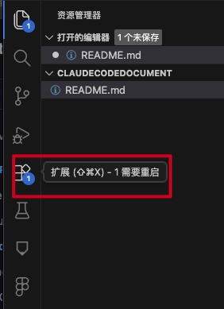
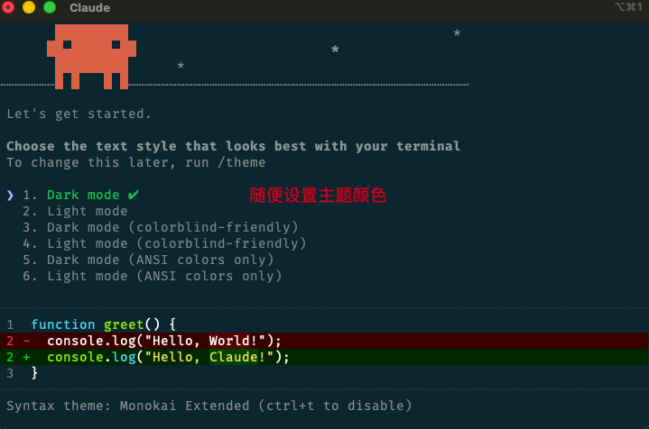
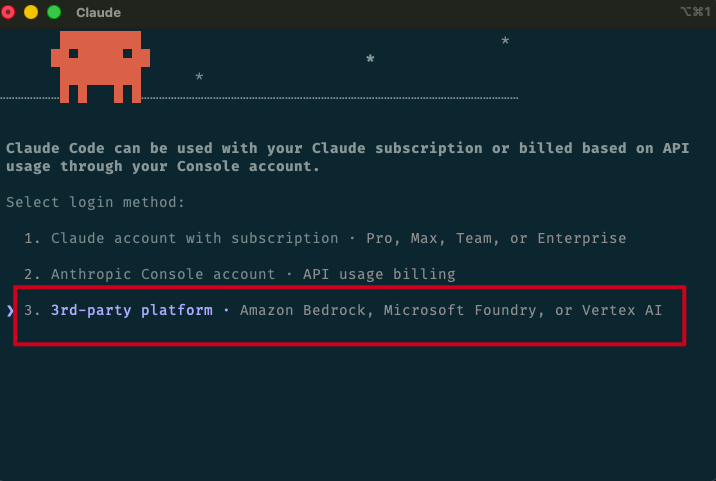
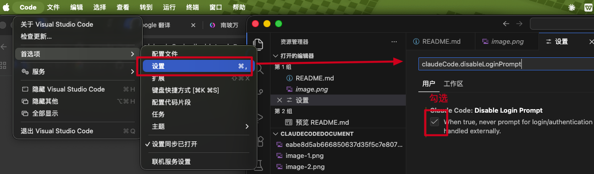
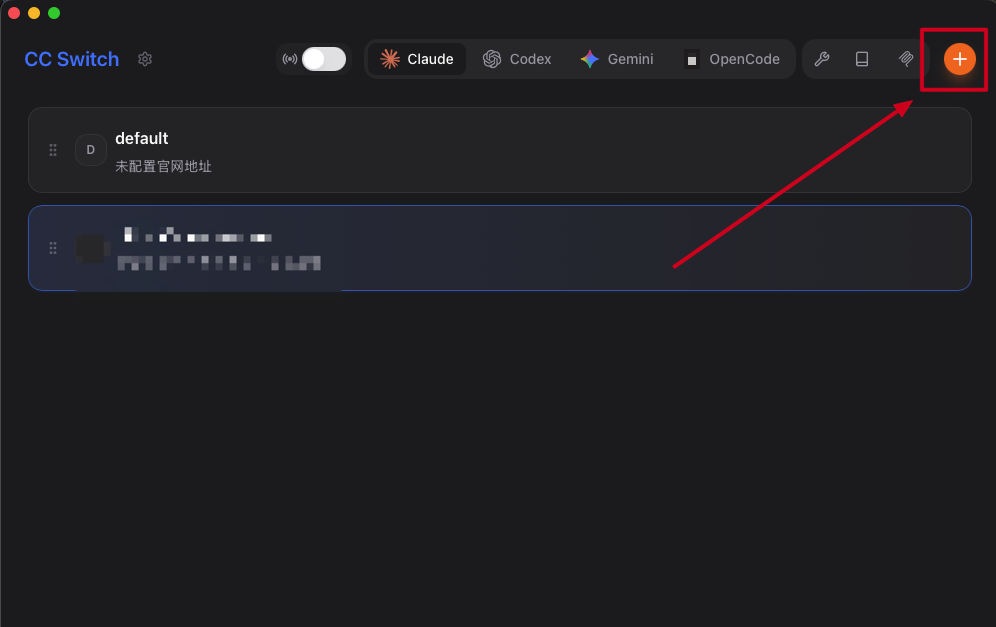

# Claude Code 使用指南

> 📌 **重要提示**：国内用户需要配置代理访问

## 目录
- [安装配置](#安装配置)
- [对话模式](#对话模式)
- [核心功能](#核心功能)
- [最佳实践](#最佳实践)

---

## 安装配置

### 前置要求

1. **网络环境**
   - 确保代理正常运行
   - 启用代理和 TUN 模式

   
   

2. **安装 Homebrew**
   ```bash
   # 访问 https://brew.sh/ 获取安装命令
   ```

### 安装步骤

#### 1. 安装 Claude Code CLI
```bash
brew install --cask claude-code
```

#### 2. 安装 cc-switch（模型切换工具）
```bash
# 添加源
brew tap farion1231/ccswitch

# 安装
brew install --cask cc-switch

# 更新
brew upgrade --cask cc-switch
```

#### 3. 安装 VSCode
下载地址：https://code.visualstudio.com/docs/setup/mac

#### 4. 安装 VSCode 扩展

1. 打开 VSCode，按 `Cmd+Shift+X` 打开扩展面板
2. 搜索 "Claude Code for VS Code" 并安装
3. 在设置中搜索 `claudeCode.disableLoginPrompt` 并勾选




#### 5. 初始化配置

在终端执行 `claude` 命令，按提示完成配置：

1. 选择颜色主题
2. 选择 **3rd-party platform** (Amazon Bedrock, Microsoft Foundry, or Vertex AI)



# 打开浏览器执行 
# vscode://settings/claudeCode.disableLoginPrompt

#### 6. 配置 cc-switch 模型

推荐配置：

| 模型类型 | 模型 ID |
|---------|---------|
| 主模型 | `claude-sonnet-4-5-20250929` |
| 推理模型 | `claude-sonnet-4-5-20250929` |
| Sonnet | `claude-sonnet-4-5-20250929` |
| Haiku | `claude-haiku-4-5-20251001` |
| Opus | `claude-opus-4-5-20251101` |



**可选**：安装中文语言包（搜索 "Chinese (Simplified)"）

---

## 对话模式

Claude Code 提供三种对话模式：

### 🛡️ Ask before edits（询问后编辑）
- **特点**：每次修改前征求确认
- **适用**：重要项目、需要精确控制
- **推荐**：⭐⭐⭐⭐⭐

### ⚡ Edit automatically（自动编辑）
- **特点**：直接修改代码，无需确认
- **适用**：快速迭代、实验项目
- **注意**：建议配合 Git 使用
- **推荐**：⭐⭐⭐⭐

### 📋 Plan demo（仅规划）
- **特点**：只提供方案，不修改代码
- **适用**：学习思路、评估方案
- **推荐**：⭐⭐⭐

**快速选择**：
```
只看思路 → Plan demo
控制改动 → Ask before edits
快速开发 → Edit automatically
```


---

## 核心功能

### 1. 文件引用（@ 符号）

使用 `@` 快速引用文件或文件夹：

```
@filename.ts              # 引用文件
@src/components/          # 引用文件夹
@README.md 优化这个文档   # 引用并提问
```

### 2. 代码上下文

在编辑器中选中代码后提问，Claude 会基于选中内容回答。

### 3. 斜杠命令

| 命令 | 功能 |
|------|------|
| `/commit` | 自动生成提交信息并提交 |
| `/review-pr` | 审查 Pull Request |
| `/help` | 查看帮助文档 |
| `/clear` | 清空对话历史 |

### 4. 快捷键

| 快捷键 | 功能 |
|--------|------|
| `Cmd+Shift+P` | 命令面板 |
| `Cmd+K` | 打开对话 |
| `Cmd+Enter` | 发送消息 |
| `Esc` | 取消操作 |

### 5. 工具能力

**文件操作**：Read、Write、Edit、Glob、Grep
**命令执行**：Bash（支持 git、npm、docker 等）
**代码分析**：理解项目结构、识别模式、提供建议

---

## 最佳实践

### ✅ 推荐做法

- 使用 `@` 引用文件提供上下文
- 选中代码后再提问
- 重要代码使用 "Ask before edits" 模式
- 定期使用 `/commit` 提交变更
- 提供明确具体的问题描述

### ❌ 避免做法

- 无版本控制时使用 "Edit automatically"
- 一次性提出过多要求
- 忽略安全提示
- 直接使用未测试的代码

### 💡 提问技巧

```
❌ "优化代码"
✅ "@app.ts 这个文件的性能瓶颈在哪里？如何优化？"

❌ "有 bug"
✅ "运行 npm test 后出现错误，帮我修复"
```

---

## 常见问题

**Q: Claude Code 会修改我的代码吗？**
A: 取决于选择的模式。"Ask before edits" 会先征求同意。

**Q: 如何撤销修改？**
A: 使用 Git：`git checkout -- <file>`

**Q: 支持哪些编程语言？**
A: 支持所有主流语言（JavaScript、Python、Java、Go、Rust 等）。

**Q: 是否需要联网？**
A: 是的，需要连接 Anthropic API（国内需要代理）。

---

## 更多资源

- 📚 [官方文档](https://docs.anthropic.com/claude/docs)
- 🐛 [问题反馈](https://github.com/anthropics/claude-code/issues)
- 💬 [社区讨论](https://github.com/anthropics/claude-code/discussions)

---

**祝你使用愉快！🎉**
