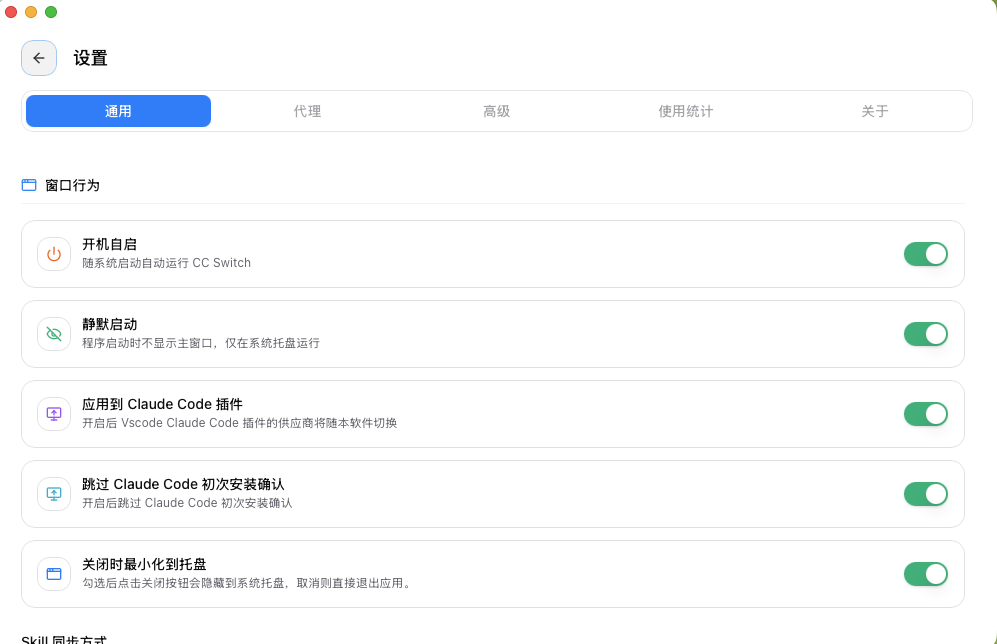
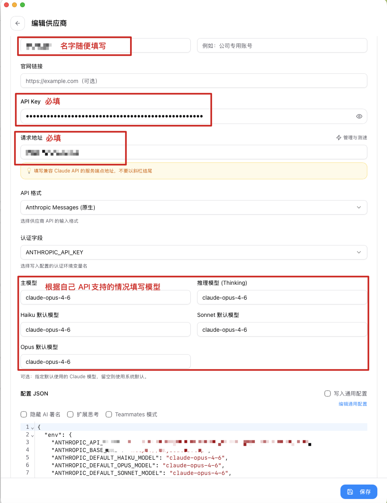
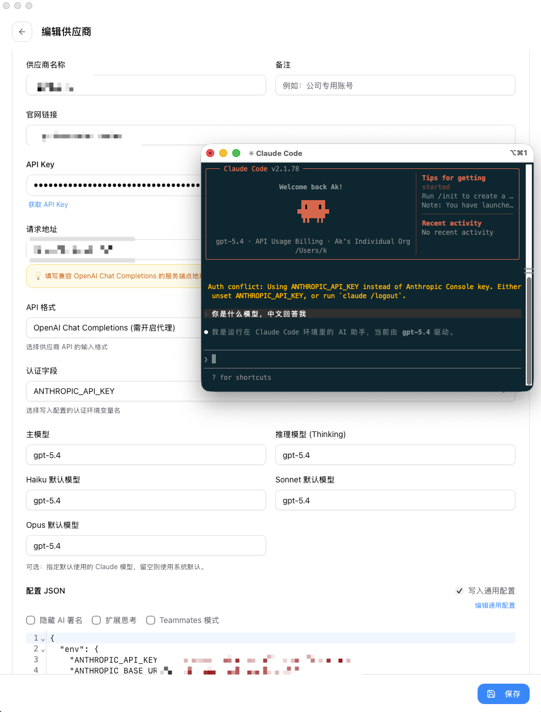
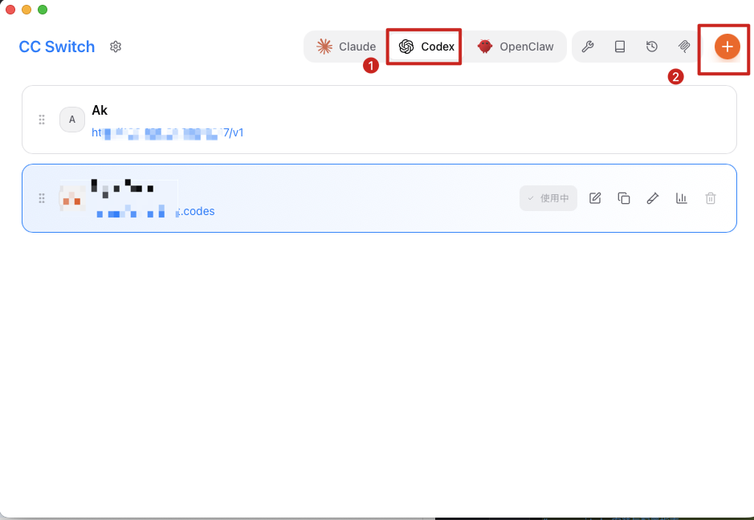
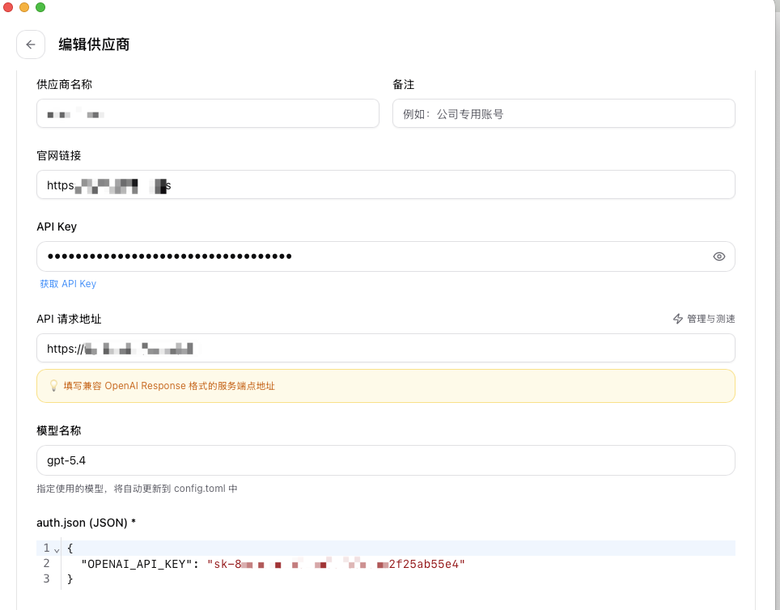

# cc-switch 安装与配置指南

## 1. 下载 cc-switch

打开 cc-switch 官方发布页：

https://github.com/farion1231/cc-switch/releases

根据你的操作系统，下载对应版本并完成安装。

### Windows

| 文件 | 说明 |
|---|---|
| `CC-Switch-xxx-Windows.msi` | 推荐使用，MSI 安装包，支持自动更新 |
| `CC-Switch-xxx-Windows-Portable.zip` | 便携版，解压后即可运行，不写入注册表 |

### macOS

| 文件 | 说明 |
|---|---|
| `CC-Switch-xxx-macOS.zip` | 推荐使用，解压后拖入“应用程序”即可，通用二进制版本 |
| `CC-Switch-xxx-macOS.tar.gz` | 适用于 Homebrew 安装及自动更新 |

---

## 2. 初始化设置

安装完成后，打开 **cc-switch**。

进入 **设置** 页面，确认以下选项已开启：

- **应用到 Claude Code 插件**
- **跳过 Claude Code 初次安装确认**

如下图所示：

---

## 3. 添加模型

完成设置后，返回 **Claude** 选项页，点击 **添加** 按钮。

cc-switch 不仅支持 **Claude 模型**，也支持接入 **第三方模型**，例如：

- GPT
- 智谱 GLM
- Kimi
- MiniMax
- DeepSeek
- LongCat 等

你可以根据自己的需求，选择不同模型接入 Claude Code 使用。

---

## 4. 添加 Claude 模型示例

下面以添加 **Claude 模型** 为例：

---

## 5. 添加 OpenAI GPT 模型示例

下面以添加 **OpenAI GPT 模型** 为例：

# Codex配置API BaseUrl KEY

