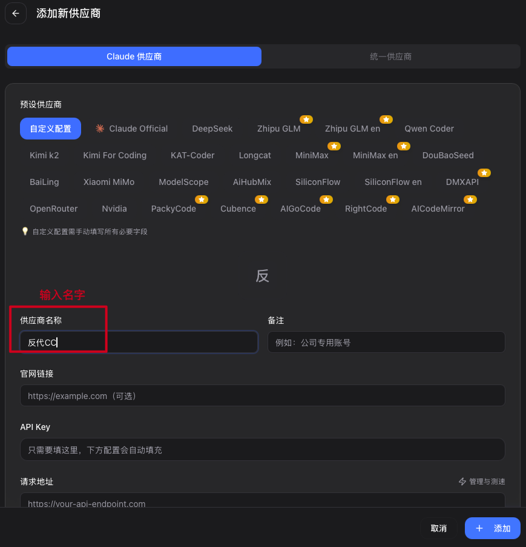
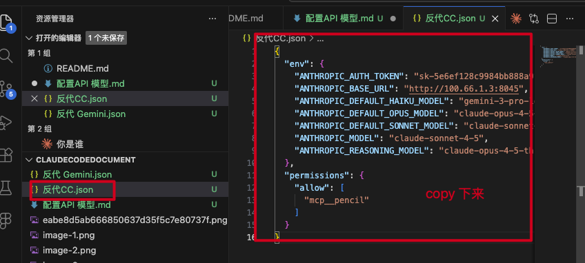
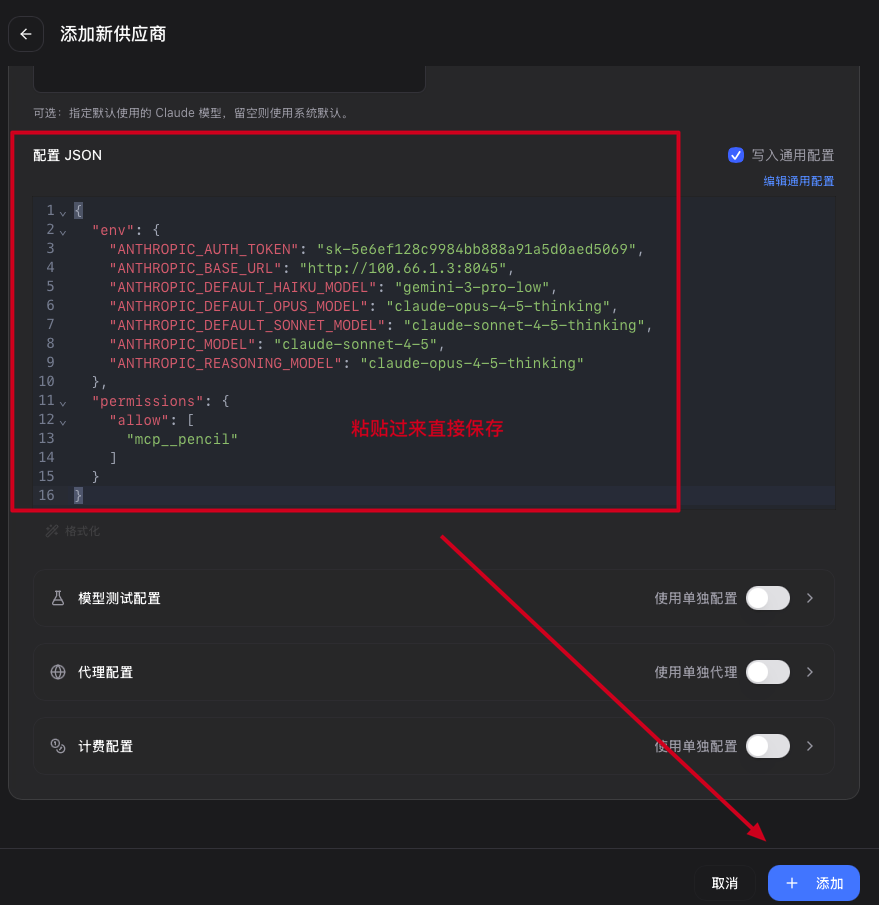
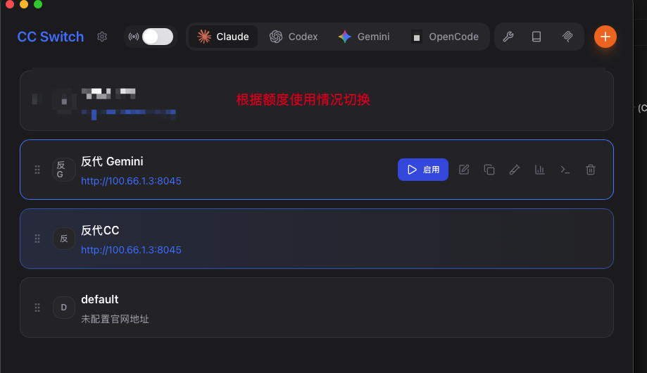

# 配置 API 模型

## 节点小宝-远程助手

**下载链接：** [节点小宝-远程助手](https://apps.apple.com/cn/app/%E8%8A%82%E7%82%B9%E5%B0%8F%E5%AE%9D-%E8%BF%9C%E7%A8%8B%E5%8A%A9%E6%89%8B/id1632648733?mt=12)

---

## 配置文件

### 1. 反代 CC.json

```json
{
  "env": {
    "ANTHROPIC_AUTH_TOKEN": "sk-5e6ef128c9984bb888a91a5d0aed5069",
    "ANTHROPIC_BASE_URL": "http://100.66.1.3:8045",
    "ANTHROPIC_DEFAULT_HAIKU_MODEL": "gemini-3-pro-low",
    "ANTHROPIC_DEFAULT_OPUS_MODEL": "claude-sonnet-4-5-thinking",
    "ANTHROPIC_DEFAULT_SONNET_MODEL": "claude-sonnet-4-5-thinking",
    "ANTHROPIC_MODEL": "claude-sonnet-4-5",
    "ANTHROPIC_REASONING_MODEL": "claude-opus-4-5-thinking"
  },
  "permissions": {
    "allow": [
      "mcp__pencil"
    ]
  }
}
```

### 2. 反代 Gemini.json

```json
{
  "env": {
    "ANTHROPIC_AUTH_TOKEN": "sk-5e6ef128c9984bb888a91a5d0aed5069",
    "ANTHROPIC_BASE_URL": "http://100.66.1.3:8045",
    "ANTHROPIC_DEFAULT_HAIKU_MODEL": "gemini-3-pro-low",
    "ANTHROPIC_DEFAULT_OPUS_MODEL": "gemini-3-pro-high",
    "ANTHROPIC_DEFAULT_SONNET_MODEL": "gemini-3-pro-high",
    "ANTHROPIC_MODEL": "gemini-3-pro-high",
    "ANTHROPIC_REASONING_MODEL": "gemini-3-pro-high"
  },
  "permissions": {
    "allow": [
      "mcp__pencil"
    ]
  }
}
```

---

## 配置截图










